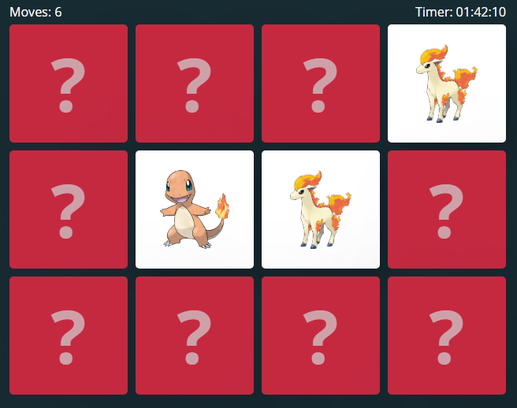

# Memory game Pokemons

## Game rules
At the beginning of the game, all the cards are mixed up and laid in rows, face down on the table.
Player starts and turns over two cards:
- If the cards don’t match (it’s not a pair), he turns them back over.
- However, if the two cards match, it’s a pair! He keeps the cards and has the right to play again.

When the player have found all the pairs, the game is over.

## Available Scripts
This project was bootstrapped with [Create React App](https://github.com/facebook/create-react-app).

In the project directory, you can run:

### `npm start`

Runs the app in the development mode. 
Open [http://localhost:3000](http://localhost:3000) to view it in the browser.

The page will reload if you make edits. 
You will also see any lint errors in the console.

### `npm build`

Builds the app for production to the `build` folder. 
It correctly bundles React in production mode and optimizes the build for the best performance.

The build is minified and the filenames include the hashes. 
Your app is ready to be deployed!

See the section about [deployment](https://facebook.github.io/create-react-app/docs/deployment) for more information.
